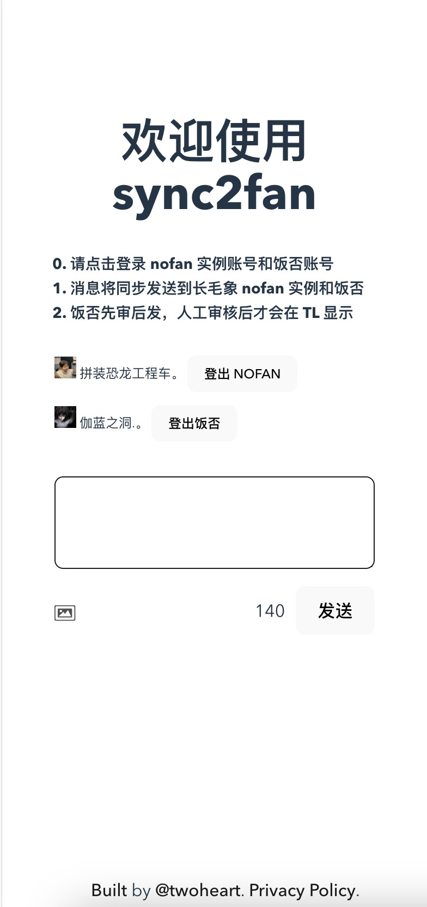

English |
[简体中文](https://github.com/twoheartliu/MixFan/blob/main/README.zh-cn.md)

<h1 align="center"/>MixFan <sup><em>alpha</em></sup></h1>

<p align="center">
A nimble web client for posting to both Fanfou and Mastodon(nofan)
</p>

<br/>

<p align="center">
  <a href="https://MixFan.nofan.xyz/" target="_blank" rel="noopener noreferrer" >
    
  </a>
</p>

## ⚠️ MixFan is in Alpha

It is already quite usable, but it isn't ready for wide adoption yet. Check out the [Open Issues](https://github.com/twoheartliu/MixFan/issues) and jump in the action.

## Deployment

Clone the repository and run on the root folder:

```
npm i
npm run dev
```

## Stack

- [Vite](https://vitejs.dev/) - Next Generation Frontend Tooling
- [Vue](https://vuejs.org/) - The Progressive JavaScript Framework
- [Pinia](https://pinia.vuejs.org/) - The Vue Store that you will enjoy using
- [Masto.js](https://neet.github.io/masto.js) - Mastodon API client in TypeScript
- [fanfou-sdk-browser](https://github.com/fanfoujs/fanfou-sdk-browser) - Fanfou SDK for browser

## License

[MIT](./LICENSE) &copy; 2023-PRESENT
